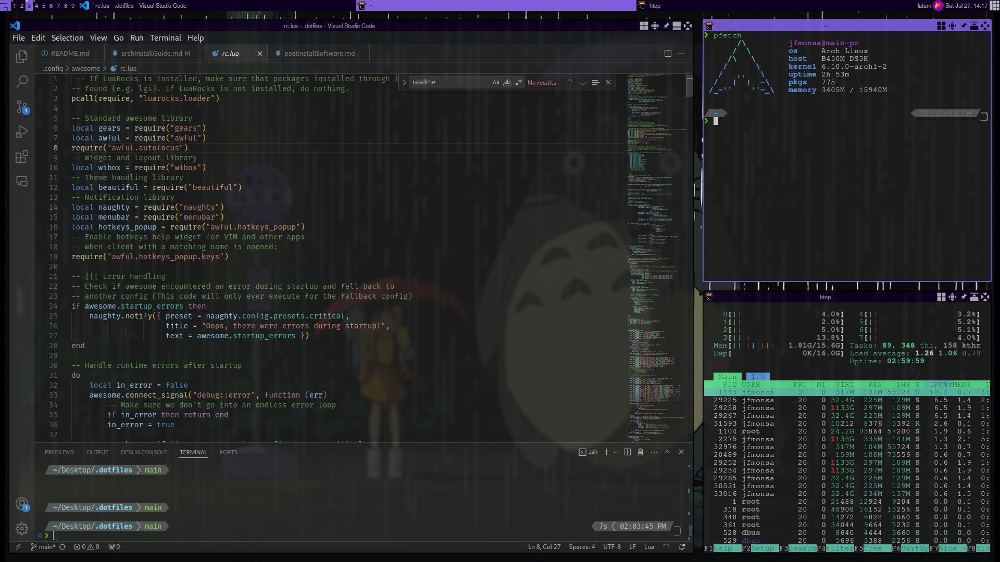

# dotfiles

- This repo is mantain for personal use, although you can use it for your dotfiles as well
- This dotfiles are based on arch it linux but you can use it for other distros

Some screenshots of my setup:

  

  

  

# How to use?

1. Clone this repo in your preferred location
2. Create symbolic links between the files/folders in the repo to your home. (create a backup and delete the existing ones of your home `~`)

> [!NOTE]  
> Ignore the assets folder and the markdown files, systemd folder contains systemd config, don't save it in home

# Useful Info

- Red this comprehensive archlinux installation guide [Arch Linux Installation Guide](docs/archInstallGuide.md)
- Get more details about the post-installation software that I currently use: [Post Installation Software guide](docs/postinstallSoftware.md)

# TODO:

- set zsh aliases
- printing with cups
- clipboard manager
- Emoji selector
- Trash management
- view images
