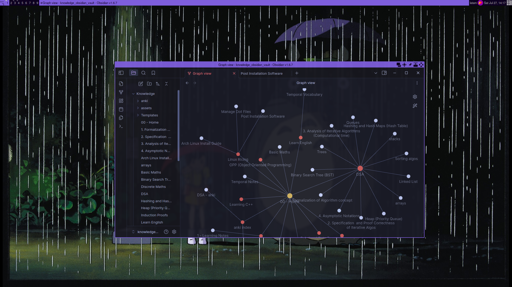

# dotfiles

+ This repo is mantain for personal use, although you can use it for your dotfiles as well
+ This dotfiles are based on arch it linux but you can use it for other distros

Some screenshots of my setup:

  

  

  

# How to use?
1. Clone this repo in your preferred location
2. Create symbolic links between the files/folders in the repo to your home (delete the existing ones of your home)

> [!NOTE]  
> Ignore the assets folder and the markdown files

# Useful Info

+ Get more details about the post-installation software that I currently use: [Post Installation Software guide](postinstallSoftware.md)
+ Red this comprehensive archlinux installation guide [Arch Linux Installation Guide](archInstallGuide.md)

# TODO:
+ set zsh aliases
+ printing with cups
+ clipboard manager
+ Emoji selector
+ Trash management
+ view images